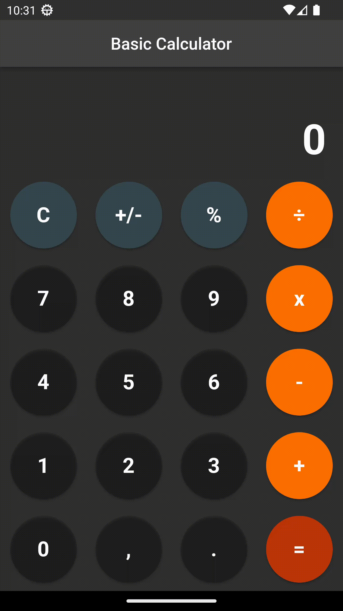

# Calculator Logic

**Task 2:**
Please write the logic to the calculator that will support basic operations (+-*/) with 2 real numbers.
Please be mindful of the MVC pattern and don't write logic into the UI classes.

## Screenshot

